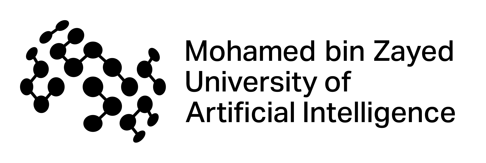

<section id="about" class="section-card hero-card">
    I am a <strong>PhD student and Powell Fellow in Computer Science at UC San Diego</strong>, advised by
    <a href="https://cseweb.ucsd.edu/~mkchandraker/">Prof. Manmohan Chandraker</a>.
    I am also supported by <strong>Powell Fellowship</strong> and  <strong>UCSD Jacobs School of Engineering Fellowship</strong>.
  

  

    Before UCSD, I completed my <strong>Master's in Machine Learning at MBZUAI</strong> in the
    <a href="https://www.ival-mbzuai.com/">IVAL lab</a>, advised by
    <a href="https://salman-h-khan.github.io/">Prof. Salman Khan</a> and co-advised by
    <a href="https://sites.google.com/view/fahadkhans/home">Prof. Fahad Khan</a>.
    I also worked as a visiting student with <a href="https://peterwonka.net/">Prof. Peter Wonka</a> at KAUST.
  

</section>

<section id="research" class="section-card">
  <h2 class="section-heading">Research Focus</h2>
  

    <article class="pillar-item">
      <h3>Intelligent Agentic Systems</h3>
      
Building multimodal agents that plan, reason, and act robustly in open-ended tasks.

    </article>
    <article class="pillar-item">
      <h3>World and Mental Models</h3>
      
Learning predictive internal models for simulation, decision support, and long-horizon behavior.

    </article>
    <article class="pillar-item">
      <h3>Spatial Reasoning</h3>
      
Developing representations and inference mechanisms for geometry-aware visual understanding.

    </article>
    <article class="pillar-item">
      <h3>Embodied AI</h3>
      
Designing grounded intelligence for perception, control, and interaction in physical environments.

    </article>
  

</section>

<section class="section-card">
  <h2 class="section-heading">Academic Trajectory</h2>
  

    

      
      <h3>UC San Diego</h3>
      
PhD in Computer Science 2025 to Present

    

    

      
      <h3>MBZUAI</h3>
      
MS in Machine Learning 2021 to Present

    

    

      
      <h3>KAUST</h3>
      
Visiting Student 2023

    

    

      
      <h3>Samsung</h3>
      
Machine Learning Engineer 2018 to 2021

    

    

      
      <h3>NIT Srinagar</h3>
      
Bachelor's in ECE, Minor in CS 2014 to 2018

    

  

</section>

<section id="news" class="section-card">
  <h2 class="section-heading">Recent News</h2>
  <ul class="news-list">
    <li>
      Mar 2026
      
One paper accepted at ML4RS workshop at ICLR 2026.

    </li>
    <li>
      Jan 2026
      
Agent-X accepted at ICLR 2026.

    </li>
    <li>
      Sep 2025
      
Began my PhD in Computer Science at UC San Diego.

    </li>
    <li>
      Sep 2025
      
Placed 2nd in the research track at UC Berkeley's AgentX challenge.

    </li>
    <li>
      Jun 2025
      
Aurelia accepted at ICCV 2025.

    </li>
    <li>
      Mar 2025
      
VideoGLaMM accepted at CVPR 2025.

    </li>
    <li>
      Jan 2025
      
VANE-Bench accepted at NAACL 2025.

    </li>
    <li>
      Mar 2024
      
Awarded ICLR 2024 Travel Grant.

    </li>
    <li>
      Oct 2023
      
Awarded NeurIPS 2023 Travel Grant.

    </li>
  </ul>
</section>

<section class="section-card publications-section">

</section>

<section class="section-card services-section">

</section>
